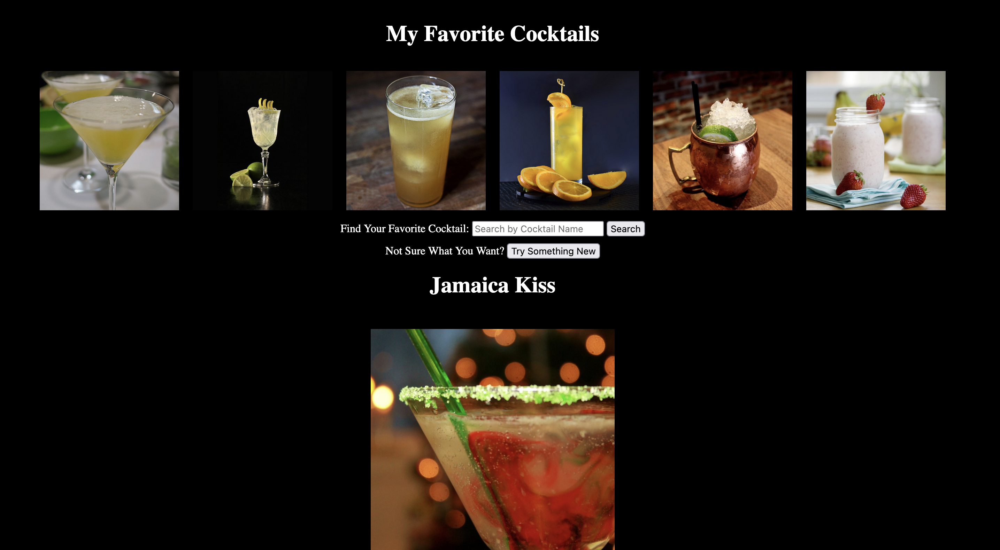
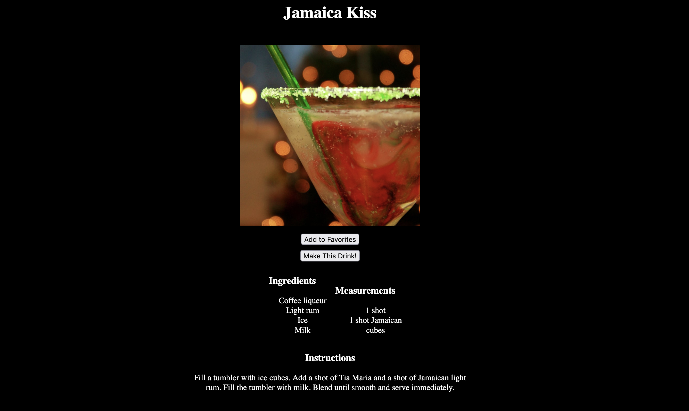

# My Favorite Cocktails App

## Description

The **My Favorite Cocktails** app is a web application to discover new cocktail recipes as well as to search and store your favorite recipes. It utilizes [The Cocktail DB API](https://www.thecocktaildb.com/api.php) to fetch cocktails based on user input or to fetch random cocktails. The app will display an image of the drink, its name and recipe. The User will be able to add any cocktail to their favorites list which will be stored in a db.json file. The User's favorite cocktails are displayed on the page and the full drink details can be displayed by clicking on the drink image.

## Features

- User can search for a recipe by cocktail name.
- Display an image of searched cocktail and its name on screen.
- Clicking on the "Make This Drink!" button will display recipe on the page.
- Add cocktail to favorites list and stores to a db.json file.
- Image of a cocktail in favorites list enlarges when moused over and returns to original size on mousing away.
- Clicking on the image of a cocktail in favorites list displays image and drink details on the screen.
- Clicking on the "Random" button will generate a random cocktail.

## Set Up

- Run `$npm install -g json-server`.
- Run `npx json-server --watch db.json` to start the server.

## Instructions

To use the My Favorite Cocktails app, follow these steps:

1. Open the `index.html` file in your web browser.
2. Enter the name of the cocktail recipe you are looking for in the Search Bar.
3. Press "Search" button to retrieve cocktail results.
4. Click the "Try Something New" button to generate random cocktail results.
5. Click on the "Make This Drink" button to display the cocktail recipe.
6. Click on the "Add to Favorites" button to add the recipe to your personal favorites list.
7. Click on the image of one of your favorite cocktails to re-display the drink details.

## Dependencies

This project relies on the following dependencies:

- [The Cocktail DB - Search By Name]("https://www.thecocktaildb.com/api/json/v1/1/search.php?s=")
- [The Cocktail DB - Random](www.thecocktaildb.com/api/json/v1/1/random.php)
- `index.html`, `style.css`, and `script.js` for front-end functionality.

## Demo

## Credits

- This app was created by Jen Kelly.
